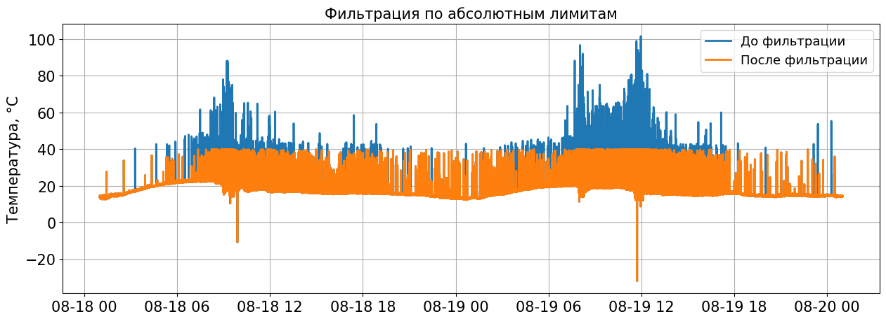
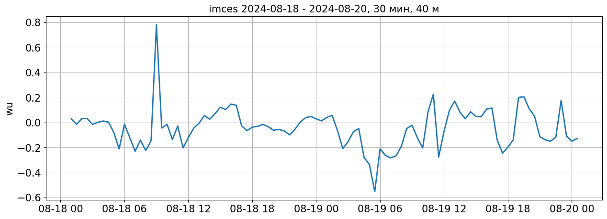

# Подготовка к обработке данных

## Импорт библиотек


```python
import eclib.mylogger as el
import eclib.datareader as dr
import eclib.dataquality as dq
import eclib.preprocessing as pp
import eclib.calculation as ec
import eclib.dataplot as dp

import logging
from datetime import datetime, timezone, timedelta
import matplotlib.pyplot as plt
import pandas as pd
import numpy as np
import glob
import os
```

## Настройка параметров обработки


```python
project_name = 'imces'  # Название проекта
input_data = './test_data/imces/IMCES_M40_A40_*.nc'  # Шаблон файлов с исходными данными
output_path = f'./{project_name}'  # Путь, куда будут сохраняться обработанные данные
z = 40  # [m], Высота измерения
friquency = 80  # [Hz], Частота исходных данных
avg_period = 30  # [min], Период осреднения 
start = pd.to_datetime('2024-08-18 01:00:00')  # Начало обрабатываемого периода 
stop = pd.to_datetime('2024-08-20 01:00:00')  # Конец обрабатываемого периода

plot = True  # Отрисовка промежуточной визуализации
show = False  # Вывод промежуточной визуализации
output_plot = True  # Отрисовка выходных переменных
output_show = False  # Вывод визуализации выходных переменных
console_log = False  # Дублирование лога в консоль

step = timedelta(minutes=avg_period) 
stop += timedelta(microseconds=1)

# ==================== Фильтрация по абсолютным лимитам ==================== 
ulim_t = 40  # [°С], Верхний предел для значений температуры
blim_t = -40 # [°С], Нижний предел для значений температуры
ulim_u = 30  # [m/s], Верхний предел для значений u компоненты скорости ветра
blim_u = -30  # [m/s], Нижний предел для значений u компоненты скорости ветра
ulim_v = 30  # [m/s], Верхний предел для значений v компоненты скорости ветра
blim_v = -30  # [m/s], Нижний предел для значений v компоненты скорости ветра
ulim_w = 5  # [m/s], Верхний предел для значений w компоненты скорости ветра
blim_w = -5  # [m/s], Нижний предел для значений w компоненты скорости ветра

# ==================== Фильтрация 'воротами' ==================== 
limit_t = 5  # [°С], Размер допустимого отклонения от среднего в абсолютных значениях для температуры
limit_u = 20  # [m/s], Размер допустимого отклонения от среднего в абсолютных значениях для u компоненты скорости ветра
limit_v = 20  # [m/s], Размер допустимого отклонения от среднего в абсолютных значениях для v компоненты скорости ветра
limit_w = 5  # [m/s], Размер допустимого отклонения от среднего в абсолютных значениях для w компоненты скорости ветра

# ==================== Фильтрация сигмами ==================== 
nsig = 3.5  # Размер допустимого отклонения от среднего в стандатных отклонениях
nsig_w = 5  # Размер допустимого отклонения от среднего в стандатных отклонениях для вертикальной скорости ветра
n = friquency  # Длина превышения, после которой превышение считается значимым
iterations = 10  # количество итераций при удалении пиков

# ==================== Расчет угла атаки ====================
minaa = -30  # [°], Верхний жесткий предел для угла атаки
maxaa = 30  # [°], Нижний жесткий предел для угла атаки

# ==================== Поворот осей координат ====================
D = 2  # Количесвто поворотов осей

# ==================== Оценка качества ====================
min_data_availability = 80  # [%], Минимально допустимое количество измерений в периоде осреднения
aaoo = 10  # [%], Максимально допустимое количество превышений по углу атаки в периоде осреднения
uhl_sk = 2  # Верхний жесткий предел для коэффициента асимметрии
bhl_sk = -2  # Нижний жесткий предел для коэффициента асимметрии
usl_sk = 1  # Верхний мягкий предел для коэффициента асимметрии
bsl_sk = -1  # Нижний мягкий предел для коэффициента асимметрии

uhl_kr = 8  # Верхний жесткий предел для коэффициента эксцесса
usl_kr = 5  # Верхний мягкий предел для коэффициента эксцесса

```

## Создание директории проекта


```python
if not os.path.exists(f'{output_path}/output'):
    os.makedirs(f'{output_path}/output')

if not os.path.exists(f'{output_path}/quality'):
    os.makedirs(f'{output_path}/quality')

if not os.path.exists(f'{output_path}/log'):
    os.makedirs(f'{output_path}/log')

if plot:
    if not os.path.exists(f'{output_path}/plots'):
        os.makedirs(f'{output_path}/plots')
    if not os.path.exists(f'{output_path}/quality/plots'):
        os.makedirs(f'{output_path}/quality/plots')
        
if output_plot:   
    if not os.path.exists(f'{output_path}/output/plots'):
        os.makedirs(f'{output_path}/output/plots')
        
```

## Запуск нового логгера


```python
logger = el.create_logger(project_name, console_log)
logger.info('НАЧАЛО ОБРАБОТКИ')
```

## Считывание данных


```python
logger.info('Считывание данных')

df = dr.read_all_files(func=dr.nc_to_df, files_pattern=input_data, logger=logger)
df.rename(columns={'temp': 't'}, inplace=True)
df
```


<div>
<style scoped>
    .dataframe tbody tr th:only-of-type {
        vertical-align: middle;
    }

    .dataframe tbody tr th {
        vertical-align: top;
    }

    .dataframe thead th {
        text-align: right;
    }
</style>
<table border="1" class="dataframe">
  <thead>
    <tr style="text-align: right;">
      <th></th>
      <th>t</th>
      <th>u</th>
      <th>v</th>
      <th>w</th>
    </tr>
    <tr>
      <th>time</th>
      <th></th>
      <th></th>
      <th></th>
      <th></th>
    </tr>
  </thead>
  <tbody>
    <tr>
      <th>2024-08-18 01:00:00.009999872</th>
      <td>14.50</td>
      <td>-0.18</td>
      <td>2.39</td>
      <td>-0.15</td>
    </tr>
    <tr>
      <th>2024-08-18 01:00:00.020000000</th>
      <td>14.58</td>
      <td>-0.25</td>
      <td>2.58</td>
      <td>-0.05</td>
    </tr>
    <tr>
      <th>2024-08-18 01:00:00.029999872</th>
      <td>14.60</td>
      <td>-0.27</td>
      <td>2.60</td>
      <td>-0.06</td>
    </tr>
    <tr>
      <th>2024-08-18 01:00:00.040000000</th>
      <td>14.58</td>
      <td>-0.31</td>
      <td>2.73</td>
      <td>-0.11</td>
    </tr>
    <tr>
      <th>2024-08-18 01:00:00.049999872</th>
      <td>14.55</td>
      <td>-0.38</td>
      <td>2.97</td>
      <td>-0.06</td>
    </tr>
    <tr>
      <th>...</th>
      <td>...</td>
      <td>...</td>
      <td>...</td>
      <td>...</td>
    </tr>
    <tr>
      <th>2024-08-20 00:59:59.760000000</th>
      <td>14.26</td>
      <td>0.39</td>
      <td>3.08</td>
      <td>0.65</td>
    </tr>
    <tr>
      <th>2024-08-20 00:59:59.769999872</th>
      <td>14.23</td>
      <td>0.56</td>
      <td>2.48</td>
      <td>0.63</td>
    </tr>
    <tr>
      <th>2024-08-20 00:59:59.780000000</th>
      <td>14.23</td>
      <td>0.57</td>
      <td>2.51</td>
      <td>0.58</td>
    </tr>
    <tr>
      <th>2024-08-20 00:59:59.789999872</th>
      <td>14.23</td>
      <td>0.67</td>
      <td>2.39</td>
      <td>0.61</td>
    </tr>
    <tr>
      <th>2024-08-20 00:59:59.800000000</th>
      <td>14.16</td>
      <td>0.65</td>
      <td>2.36</td>
      <td>0.57</td>
    </tr>
  </tbody>
</table>
<p>13848872 rows × 4 columns</p>
</div>


```python
if plot:
    labels = 'Данные до обработки'
    dp.plot_timeseries(df.t, labels = labels, ylabel = 'Температура, °С', 
                       filename = f'{output_path}/plots/{start.date()}-{stop.date()}_t_input_data_{avg_period}min.png')
    dp.plot_timeseries(df.u, labels = labels, ylabel = 'u, м/с', 
                       filename = f'{output_path}/plots/{start.date()}-{stop.date()}_u_input_data_{avg_period}min.png')
    dp.plot_timeseries(df.v, labels = labels, ylabel = 'v, м/с', 
                       filename = f'{output_path}/plots/{start.date()}-{stop.date()}_v_input_data_{avg_period}min.png')
    dp.plot_timeseries(df.w, labels = labels, ylabel = 'w, м/с', 
                       filename = f'{output_path}/plots/{start.date()}-{stop.date()}_w_input_data_{avg_period}min.png')
```

    Данные до обработки


    

    


    Данные до обработки


    

    


    Данные до обработки


    

    


    Данные до обработки


    

    


# Обработка данных

## Разбиение данных на периоды осреднения


```python
logger.info('Расчет интервалов осреднения')
df_bins = pp.create_bins(ser=df, step=step, start=start, stop=stop)
```

## Подсчет данных перед обработкой


```python
counts_before_processing = dq.counts(df, df_bins)
```

## Фильтрация по абсолютным лимитам


```python
logger.info('Фильтрация по абсолютным лимитам')
t = pp.absolute_limits_filtration(df.t, ulim=ulim_t, blim=blim_t, logger=logger)
u = pp.absolute_limits_filtration(df.u, ulim=ulim_u, blim=blim_u, logger=logger)
v = pp.absolute_limits_filtration(df.v, ulim=ulim_v, blim=blim_v, logger=logger)
w = pp.absolute_limits_filtration(df.w, ulim=ulim_w, blim=blim_w, logger=logger)

```


```python
if plot:
    title = 'Фильтрация по абсолютным лимитам'
    labels = ['До фильтрации', 'После фильтрации']
    dp.plot_timeseries([df.t, t], labels = labels, title = title, ylabel = 'Температура, °С',
                       filename = f'{output_path}/plots/{start.date()}-{stop.date()}_t_absolute_limits_filtration_{avg_period}min.png')
    dp.plot_timeseries([df.u, u], labels = labels, title = title, ylabel = 'u, м/с', 
                       filename = f'{output_path}/plots/{start.date()}-{stop.date()}_u_absolute_limits_filtration_{avg_period}min.png')
    dp.plot_timeseries([df.v, v], labels = labels, title = title, ylabel = 'v, м/с', 
                       filename = f'{output_path}/plots/{start.date()}-{stop.date()}_v_absolute_limits_filtration_{avg_period}min.png')
    dp.plot_timeseries([df.w, w], labels = labels, title = title, ylabel = 'w, м/с',
                       filename = f'{output_path}/plots/{start.date()}-{stop.date()}_w_absolute_limits_filtration_{avg_period}min.png')

```

    До фильтрации
    После фильтрации


    

    


    До фильтрации
    После фильтрации


    

    


    До фильтрации
    После фильтрации


    

    


    До фильтрации
    После фильтрации


    

    


```python
df1 = pd.DataFrame({
    't': t,
    'u': u,
    'v': v,
    'w': w
})
```

## Фильтрация "воротами"


```python
logger.info("Фильтрация 'воротами'")
pp.gates_filtration(t, limit_t, df_bins, logger=logger, inplace=True)
pp.gates_filtration(u, limit_u, df_bins, logger=logger, inplace=True)
pp.gates_filtration(v, limit_v, df_bins, logger=logger, inplace=True)
pp.gates_filtration(w, limit_w, df_bins, logger=logger, inplace=True)
```


    time
    2024-08-18 01:00:00.009999872   -0.15
    2024-08-18 01:00:00.020000000   -0.05
    2024-08-18 01:00:00.029999872   -0.06
    2024-08-18 01:00:00.040000000   -0.11
    2024-08-18 01:00:00.049999872   -0.06
                                     ... 
    2024-08-20 00:59:59.760000000    0.65
    2024-08-20 00:59:59.769999872    0.63
    2024-08-20 00:59:59.780000000    0.58
    2024-08-20 00:59:59.789999872    0.61
    2024-08-20 00:59:59.800000000    0.57
    Name: w, Length: 13848872, dtype: float64


```python
if plot:
    title = 'Фильтрация "воротами"'
    labels = ['До фильтрации', 'После фильтрации']
    dp.plot_timeseries([df1.t, t], labels = labels, title = title, ylabel = 'Температура, °С',
                       filename = f'{output_path}/plots/{start.date()}-{stop.date()}_t_gates_filtration_{avg_period}min.png')
    dp.plot_timeseries([df1.u, u], labels = labels, title = title, ylabel = 'u, м/с', 
                       filename = f'{output_path}/plots/{start.date()}-{stop.date()}_u_gates_filtration_{avg_period}min.png')
    dp.plot_timeseries([df1.v, v], labels = labels, title = title, ylabel = 'v, м/с', 
                       filename = f'{output_path}/plots/{start.date()}-{stop.date()}_v_gates_filtration_{avg_period}min.png')
    dp.plot_timeseries([df1.w, w], labels = labels, title = title, ylabel = 'w, м/с', 
                       filename = f'{output_path}/plots/{start.date()}-{stop.date()}_w_gates_filtration_{avg_period}min.png')
```

    До фильтрации
    После фильтрации


    

    


    До фильтрации
    После фильтрации


    

    


    До фильтрации
    После фильтрации


    

    


    До фильтрации
    После фильтрации


    

    


```python
df1 = pd.DataFrame({
    't': t,
    'u': u,
    'v': v,
    'w': w
})
```

## Детрендинг


```python
if plot:
    df1_trend = pp.detrend(df1, df_bins, mode = 'trend')
    labels = ['Данные до детрендинга', 'Тренды до детрендинга']
    dp.plot_timeseries([df1.t, df1_trend.t], labels = labels, ylabel = 'Температура, °С',
                       filename = f'{output_path}/plots/{start.date()}-{stop.date()}_t_before_detrending_{avg_period}min.png')
    dp.plot_timeseries([df1.u, df1_trend.u], labels = labels, ylabel = 'u, м/с',
                       filename = f'{output_path}/plots/{start.date()}-{stop.date()}_u_before_detrending_{avg_period}min.png')
    dp.plot_timeseries([df1.v, df1_trend.v], labels = labels, ylabel = 'v, м/с',
                       filename = f'{output_path}/plots/{start.date()}-{stop.date()}_v_before_detrending_{avg_period}min.png')
    dp.plot_timeseries([df1.w, df1_trend.w], labels = labels, ylabel = 'w, м/с',
                       filename = f'{output_path}/plots/{start.date()}-{stop.date()}_w_before_detrending_{avg_period}min.png')
```

    Данные до детрендинга
    Тренды до детрендинга


    

    


    Данные до детрендинга
    Тренды до детрендинга


    

    


    Данные до детрендинга
    Тренды до детрендинга


    

    


    Данные до детрендинга
    Тренды до детрендинга


    

    


```python
pp.detrend(df1, df_bins=df_bins, mode='dwm', logger=logger, inplace=True)
```


<div>
<style scoped>
    .dataframe tbody tr th:only-of-type {
        vertical-align: middle;
    }

    .dataframe tbody tr th {
        vertical-align: top;
    }

    .dataframe thead th {
        text-align: right;
    }
</style>
<table border="1" class="dataframe">
  <thead>
    <tr style="text-align: right;">
      <th></th>
      <th>t</th>
      <th>u</th>
      <th>v</th>
      <th>w</th>
    </tr>
    <tr>
      <th>time</th>
      <th></th>
      <th></th>
      <th></th>
      <th></th>
    </tr>
  </thead>
  <tbody>
    <tr>
      <th>2024-08-18 01:00:00.009999872</th>
      <td>14.480536</td>
      <td>0.102335</td>
      <td>1.827842</td>
      <td>-0.143909</td>
    </tr>
    <tr>
      <th>2024-08-18 01:00:00.020000000</th>
      <td>14.560536</td>
      <td>0.032331</td>
      <td>2.017850</td>
      <td>-0.043909</td>
    </tr>
    <tr>
      <th>2024-08-18 01:00:00.029999872</th>
      <td>14.580537</td>
      <td>0.012327</td>
      <td>2.037858</td>
      <td>-0.053909</td>
    </tr>
    <tr>
      <th>2024-08-18 01:00:00.040000000</th>
      <td>14.560537</td>
      <td>-0.027677</td>
      <td>2.167866</td>
      <td>-0.103909</td>
    </tr>
    <tr>
      <th>2024-08-18 01:00:00.049999872</th>
      <td>14.530538</td>
      <td>-0.097681</td>
      <td>2.407873</td>
      <td>-0.053909</td>
    </tr>
    <tr>
      <th>...</th>
      <td>...</td>
      <td>...</td>
      <td>...</td>
      <td>...</td>
    </tr>
    <tr>
      <th>2024-08-20 00:59:59.760000000</th>
      <td>14.313226</td>
      <td>0.706072</td>
      <td>2.959187</td>
      <td>0.636990</td>
    </tr>
    <tr>
      <th>2024-08-20 00:59:59.769999872</th>
      <td>14.283226</td>
      <td>0.876076</td>
      <td>2.359185</td>
      <td>0.616990</td>
    </tr>
    <tr>
      <th>2024-08-20 00:59:59.780000000</th>
      <td>14.283227</td>
      <td>0.886080</td>
      <td>2.389184</td>
      <td>0.566989</td>
    </tr>
    <tr>
      <th>2024-08-20 00:59:59.789999872</th>
      <td>14.283228</td>
      <td>0.986085</td>
      <td>2.269182</td>
      <td>0.596989</td>
    </tr>
    <tr>
      <th>2024-08-20 00:59:59.800000000</th>
      <td>14.213229</td>
      <td>0.966089</td>
      <td>2.239180</td>
      <td>0.556989</td>
    </tr>
  </tbody>
</table>
<p>13848872 rows × 4 columns</p>
</div>


```python
if plot:
    df1_trend = pp.detrend(df1, df_bins = df_bins, mode = 'trend')
    labels = ['Данные после детрендинга', 'Тренды после детрендинга']
    dp.plot_timeseries([df1.t, df1_trend.t], labels = labels, ylabel = 'Температура, °С',
                       filename = f'{output_path}/plots/{start.date()}-{stop.date()}_t_after_detrending_{avg_period}min.png')
    dp.plot_timeseries([df1.u, df1_trend.u], labels = labels, ylabel = 'u, м/с',
                       filename = f'{output_path}/plots/{start.date()}-{stop.date()}_u_after_detrending_{avg_period}min.png')
    dp.plot_timeseries([df1.v, df1_trend.v], labels = labels, ylabel = 'v, м/с',
                       filename = f'{output_path}/plots/{start.date()}-{stop.date()}_v_after_detrending_{avg_period}min.png')
    dp.plot_timeseries([df1.w, df1_trend.w], labels = labels, ylabel = 'w, м/с',
                       filename = f'{output_path}/plots/{start.date()}-{stop.date()}_w_after_detrending_{avg_period}min.png')
    
```

    Данные после детрендинга
    Тренды после детрендинга


    

    


    Данные после детрендинга
    Тренды после детрендинга


    

    


    Данные после детрендинга
    Тренды после детрендинга


    

    


    Данные после детрендинга
    Тренды после детрендинга


    

    


## Фильтрация сигмами


```python
t = pp.sigmas_filtration(df1.t, nsig=nsig, n=n, iterations=iterations, df_bins=df_bins, logger=logger)
u = pp.sigmas_filtration(df1.u, nsig=nsig, n=n, iterations=iterations, df_bins=df_bins, logger=logger)
v = pp.sigmas_filtration(df1.v, nsig=nsig, n=n, iterations=iterations, df_bins=df_bins, logger=logger)
w = pp.sigmas_filtration(df1.w, nsig=nsig_w, n=n, iterations=iterations, df_bins=df_bins, logger=logger)
```


```python
if plot:
    title = 'Фильтрация сигмами'
    labels = ['До фильтрации', 'После фильтрации']
    dp.plot_timeseries([df1.t, t], labels = labels, ylabel = 'Температура, °С', title = title,
                       filename = f'{output_path}/plots/{start.date()}-{stop.date()}_t_sigmas_filtration_{avg_period}min.png')
    dp.plot_timeseries([df1.u, u], labels = labels, ylabel = 'u, м/с', title = title,
                       filename = f'{output_path}/plots/{start.date()}-{stop.date()}_u_sigmas_filtration_{avg_period}min.png')
    dp.plot_timeseries([df1.v, v], labels = labels, ylabel='v, м/с', title = title,
                       filename = f'{output_path}/plots/{start.date()}-{stop.date()}_v_sigmas_filtration_{avg_period}min.png')
    dp.plot_timeseries([df1.w, w], labels = labels, ylabel='w, м/с', title = title,
                       filename = f'{output_path}/plots/{start.date()}-{stop.date()}_w_sigmas_filtration_{avg_period}min.png')
```

    До фильтрации
    После фильтрации


    

    


    До фильтрации
    После фильтрации


    

    


    До фильтрации
    После фильтрации


    

    


    До фильтрации
    После фильтрации


    

    


```python
df1 = pd.DataFrame({
    't': t,
    'u': u,
    'v': v,
    'w': w
})
```

## Заполнение пропусков


```python
counts_before_gapfilling = dq.counts(df1, df_bins)
```


```python
pp.fillgaps(df1, inplace=True)
```


```python
counts_after_gapfilling = dq.counts(df1, df_bins)
```

## Расчет угла атаки


```python
bad_angles_counts, angles = dq.angle_of_attack_counts(df1, df_bins, minaa=minaa, maxaa=maxaa)
angles_means = ec.means(angles, df_bins)
```

## Поворот осей координат


```python
df1_rot, angles_of_rotations = pp.axis_rotations(df1, D, df_bins, logger=logger, inplace=False)
```

## Расчет средних значений


```python
df1_means = ec.means(df1, df_bins)
df1_rot_means = ec.means(df1_rot, df_bins)
```


```python
if plot:
    labels = ['Данные до поворота','Данные после поворота','Средние до поворота','Средние после поворота']
    dp.plot_timeseries([df1.u, df1_rot.u, df1_means.u, df1_rot_means.u], labels = labels, ylabel = 'u, м/с',
                       filename = f'{output_path}/plots/{start.date()}-{stop.date()}_u_axis_rotations_{avg_period}min.png')
    dp.plot_timeseries([df1.v, df1_rot.v, df1_means.v, df1_rot_means.v], labels = labels, ylabel = 'v, м/с',
                       filename = f'{output_path}/plots/{start.date()}-{stop.date()}_v_axis_rotations_{avg_period}min.png')
    dp.plot_timeseries([df1.w, df1_rot.w, df1_means.w, df1_rot_means.w], labels = labels, ylabel = 'w, м/с',
                       filename = f'{output_path}/plots/{start.date()}-{stop.date()}_w_axis_rotations_{avg_period}min.png')
```

    Данные до поворота
    Данные после поворота
    Средние до поворота
    Средние после поворота


    

    


    Данные до поворота
    Данные после поворота
    Средние до поворота
    Средние после поворота


    

    


    Данные до поворота
    Данные после поворота
    Средние до поворота
    Средние после поворота


    

    


## Оценка качетсва 


```python
data_availability = counts_before_gapfilling / counts_before_processing * 100
data_availability_flags = data_availability < min_data_availability
if plot:
    title = f'Количество данных до восстановления пропусков с {start.date()} по {stop.date()} ({avg_period} мин)'
    dp.plot_timeseries(data_availability, labels = counts_after_gapfilling.columns, title = title, loc = 'lower left', ylabel = '%',
                       filename = f'{output_path}/quality/{start.date()}-{stop.date()}_counts_before_gapfilling_{avg_period}min.png')
```

    Index(['t', 'u', 'v', 'w'], dtype='object')


    

    


```python
bad_angles_percent = bad_angles_counts / counts_after_gapfilling.u * 100
bad_angles_flags = bad_angles_percent > aaoo

if plot:
    uhl = pd.Series(aaoo, index = angles.index)
    clrs = [None, 'k']
    title=f'Количество превышений критического угла атаки с {start.date()} по {stop.date()} ({avg_period} мин)'
    dp.plot_timeseries([bad_angles_percent, uhl], labels = [None,'uhl'], clrs = clrs, ylabel = '%', title = title,
                       filename = f'{output_path}/quality/plots/{start.date()}-{stop.date()}_bad_angles_counts_{avg_period}min.png')
    
    uhl = pd.Series(maxaa, index = angles.index)
    bhl = pd.Series(minaa, index = angles.index)
    clrs = [None, None, 'k', 'k']
    labels = [None, 'avg', 'uhl', 'bhl']
    title = f'Углы атаки с {start.date()} по {stop.date()} ({avg_period} мин)'
    dp.plot_timeseries([angles, angles_means, uhl, bhl], labels = labels, clrs = clrs, title = title, ylabel = '°',
                       filename = f'{output_path}/quality/plots/{start.date()}-{stop.date()}_angles_of_atack_{avg_period}min.png')

```

    None
    uhl


    

    


    None
    avg
    uhl
    bhl


    

    


```python
skew = dq.skewness(df1_rot, df_bins)
skew_flags = (skew < bhl_sk) | (skew > uhl_sk)

if plot:
    uhl = pd.Series(uhl_sk, index = skew.index)
    bhl = pd.Series(bhl_sk, index = skew.index)
    usl = pd.Series(usl_sk, index = skew.index)
    bsl = pd.Series(bsl_sk, index = skew.index)
    
    title = f'Коэффициент асимметрии с {start.date()} по {stop.date()} ({avg_period} мин)'
    clrs = [ None, 'k', 'k', 'gray', 'gray']
    labels = [skew.columns, 'hl', None, 'sl', None]
    dp.plot_timeseries([skew, uhl, bhl, usl, bsl], labels = labels, clrs = clrs, title = title,
                       filename = f'{output_path}/quality/plots/{start.date()}-{stop.date()}_skewness_{avg_period}min.png')
```

    Index(['t', 'u', 'v', 'w'], dtype='object')
    hl
    None
    sl
    None


    

    


```python
kurt = dq.kurtosis(df1_rot, df_bins)
kurt_flags = kurt > uhl_kr

if plot:
    uhl = pd.Series(uhl_kr, index=kurt.index)
    # bhl = pd.Series(bhl_kr, index=kurt.index)
    usl = pd.Series(usl_kr, index=kurt.index)
    # bsl = pd.Series(bsl_kr, index=kurt.index) 
    
    title = f'Коэффициент эксцесса с {start.date()} по {stop.date()} ({avg_period} мин)'
    clrs = [None, 'k', 'gray']
    labels = [kurt.columns, 'uhl', 'usl']
    dp.plot_timeseries([kurt, uhl, usl], clrs = clrs, labels = labels, title = title,
                       filename = f'{output_path}/quality/plots/{start.date()}-{stop.date()}_kurtosis_{avg_period}min.png')
```

    Index(['t', 'u', 'v', 'w'], dtype='object')
    uhl
    usl


    

    


```python
hard_flags = (data_availability_flags + skew_flags + kurt_flags)
hard_flags = hard_flags.add(bad_angles_flags, axis=0)

if plot:
    title = f'Маска жестких флагов качества {start.date()} по {stop.date()} ({avg_period} мин)'
    dp.plot_timeseries(hard_flags, labels=hard_flags.columns, title = title,
                       filename = f'{output_path}/quality/plots/{start.date()}-{stop.date()}_hard_flags_{avg_period}min.png')
```

    Index(['t', 'u', 'v', 'w'], dtype='object')


    

    


```python
counts_before_processing.to_csv(f'{output_path}/quality/{start.date()}-{stop.date()}_counts_before_processing_{avg_period}min.csv')
counts_before_gapfilling.to_csv(f'{output_path}/quality/{start.date()}-{stop.date()}_counts_before_gapfilling_{avg_period}min.csv')
counts_after_gapfilling.to_csv(f'{output_path}/quality/{start.date()}-{stop.date()}_counts_after_gapfilling_{avg_period}min.csv')
bad_angles_counts.to_csv(f'{output_path}/quality/{start.date()}-{stop.date()}_bad_angles_counts_{avg_period}min.csv')
skew.to_csv(f'{output_path}/quality/{start.date()}-{stop.date()}_skewness_{avg_period}min.csv')
kurt.to_csv(f'{output_path}/quality/{start.date()}-{stop.date()}_kurtosis_{avg_period}min.csv')
angles_of_rotations.to_csv(f'{output_path}/quality/{start.date()}-{stop.date()}_angles_of_rotations_{avg_period}min.csv')
hard_flags.to_csv(f'{output_path}/quality/{start.date()}-{stop.date()}_hard_flags_{avg_period}min.csv')
```

## Расчет пульсаций и моментов


```python
ec.pulsations(df1_rot, df_bins=df_bins, inplace=True)
```


<div>
<style scoped>
    .dataframe tbody tr th:only-of-type {
        vertical-align: middle;
    }

    .dataframe tbody tr th {
        vertical-align: top;
    }

    .dataframe thead th {
        text-align: right;
    }
</style>
<table border="1" class="dataframe">
  <thead>
    <tr style="text-align: right;">
      <th></th>
      <th>t</th>
      <th>u</th>
      <th>v</th>
      <th>w</th>
    </tr>
    <tr>
      <th>time</th>
      <th></th>
      <th></th>
      <th></th>
      <th></th>
    </tr>
  </thead>
  <tbody>
    <tr>
      <th>2024-08-18 01:00:00.009999872</th>
      <td>1.045061</td>
      <td>0.463062</td>
      <td>1.032341</td>
      <td>-0.159902</td>
    </tr>
    <tr>
      <th>2024-08-18 01:00:00.020000000</th>
      <td>1.125061</td>
      <td>0.263173</td>
      <td>1.070619</td>
      <td>-0.062012</td>
    </tr>
    <tr>
      <th>2024-08-18 01:00:00.029999872</th>
      <td>1.145062</td>
      <td>0.235813</td>
      <td>1.063836</td>
      <td>-0.072302</td>
    </tr>
    <tr>
      <th>2024-08-18 01:00:00.040000000</th>
      <td>1.125062</td>
      <td>0.104377</td>
      <td>1.096785</td>
      <td>-0.123696</td>
    </tr>
    <tr>
      <th>2024-08-18 01:00:00.049999872</th>
      <td>1.095062</td>
      <td>-0.137784</td>
      <td>1.160907</td>
      <td>-0.076257</td>
    </tr>
    <tr>
      <th>...</th>
      <td>...</td>
      <td>...</td>
      <td>...</td>
      <td>...</td>
    </tr>
    <tr>
      <th>2024-08-20 00:59:59.760000000</th>
      <td>-0.047748</td>
      <td>-0.257720</td>
      <td>-0.006701</td>
      <td>0.471401</td>
    </tr>
    <tr>
      <th>2024-08-20 00:59:59.769999872</th>
      <td>-0.077748</td>
      <td>-0.802836</td>
      <td>-0.310118</td>
      <td>0.480918</td>
    </tr>
    <tr>
      <th>2024-08-20 00:59:59.780000000</th>
      <td>-0.077747</td>
      <td>-0.774093</td>
      <td>-0.312956</td>
      <td>0.429287</td>
    </tr>
    <tr>
      <th>2024-08-20 00:59:59.789999872</th>
      <td>-0.077746</td>
      <td>-0.866123</td>
      <td>-0.437874</td>
      <td>0.464319</td>
    </tr>
    <tr>
      <th>2024-08-20 00:59:59.800000000</th>
      <td>-0.147745</td>
      <td>-0.902034</td>
      <td>-0.425313</td>
      <td>0.426206</td>
    </tr>
  </tbody>
</table>
<p>13848872 rows × 4 columns</p>
</div>


```python
df1_rot_means['uu']     = ec.stat_moments(df1_rot[['u']*2], df_bins)
df1_rot_means['vv']     = ec.stat_moments(df1_rot[['v']*2], df_bins)
df1_rot_means['ww']     = ec.stat_moments(df1_rot[['w']*2], df_bins)
df1_rot_means['tt']     = ec.stat_moments(df1_rot[['t']*2], df_bins)
df1_rot_means['wu']     = ec.stat_moments(df1_rot[['w','u']], df_bins)
df1_rot_means['wv']     = ec.stat_moments(df1_rot[['w','v']], df_bins)
df1_rot_means['wt']     = ec.stat_moments(df1_rot[['w','t']], df_bins)
df1_rot_means['wu_h']   = (df1_rot_means.wu ** 2 + df1_rot_means.wv ** 2) ** 0.5
df1_rot_means['u_star'] = df1_rot_means.wu_h ** 0.5
df1_rot_means['L']      = -(df1_rot_means.t + 273.15) * df1_rot_means.u_star ** 3 / ( 9.8 * 0.4 * df1_rot_means.wt) 
df1_rot_means['zeta']   = z / df1_rot_means.L
df1_rot_means['TKE']    = (df1_rot_means.uu + df1_rot_means.vv + df1_rot_means.ww) / 2
df1_rot_means['A']      = df1_rot_means.ww / (df1_rot_means.uu + df1_rot_means.vv + df1_rot_means.ww)
df1_rot_means['wuu']    = ec.stat_moments(df1_rot[['w','u','u']], df_bins)
df1_rot_means['wvv']    = ec.stat_moments(df1_rot[['w','v','v']], df_bins)
df1_rot_means['wtt']    = ec.stat_moments(df1_rot[['w','t','t']], df_bins)
df1_rot_means['wwt']    = ec.stat_moments(df1_rot[['w','w','t']], df_bins)
df1_rot_means['uuu']    = ec.stat_moments(df1_rot[['u']*3], df_bins)
df1_rot_means['vvv']    = ec.stat_moments(df1_rot[['v']*3], df_bins)
df1_rot_means['www']    = ec.stat_moments(df1_rot[['w']*3], df_bins)
df1_rot_means['ttt']    = ec.stat_moments(df1_rot[['t']*3], df_bins)

df1_rot_means.to_csv(f'{output_path}/output/{start.date()}-{stop.date()}_moments_{avg_period}min.csv')
```


```python
if output_plot:
    for var_name in df1_rot_means:
        title = f'{project_name} {start.date()} - {stop.date()}, {avg_period} мин, {z} м'
        dp.plot_timeseries(df1_rot_means[var_name], ylabel = var_name, title = title,
                          filename = f'{output_path}/output/plots/{start.date()}-{stop.date()}_{var_name}_{avg_period}min.png')
        
```

    None


    

    


    None


    

    


    None


    

    


    None


    

    


    None


    

    


    None


    

    


    None


    

    


    None


    

    


    None


    

    


    None


    

    


    None


    

    


    None


    

    


    None


    

    


    None


    

    


    None


    

    


    None


    

    


    None


    

    


    None


    

    


    None


    

    


    None


    

    


    None


    

    


    None


    

    


    None


    

    


    None


    

    


    None


    

    


## Закрытие логгера


```python
logger.info('КОНЕЦ ОБРАБОТКИ')
el.close_logger(logger)
```


```python

```

    None


    

    


    None


    

    


    None


    

    


    None


    

    


    None


    

    


    None


    

    


    None


    

    


    None


    

    


    None


    

    


    None


    

    


    None


    

    


    None


    

    


    None


    

    


    None


    

    


    None


    

    


    None


    

    


    None


    

    


    None


    

    


    None


    

    


    None


    

    


    None


    

    


    None


    

    


    None


    

    


    None


    

    


    None


    

    


```python

```
